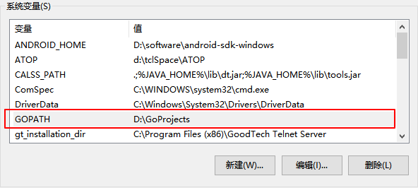
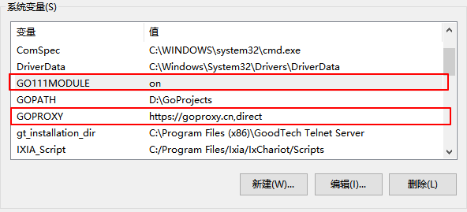
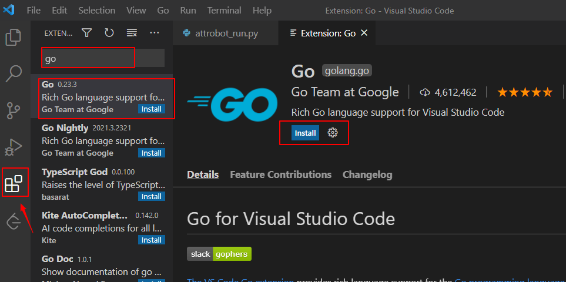
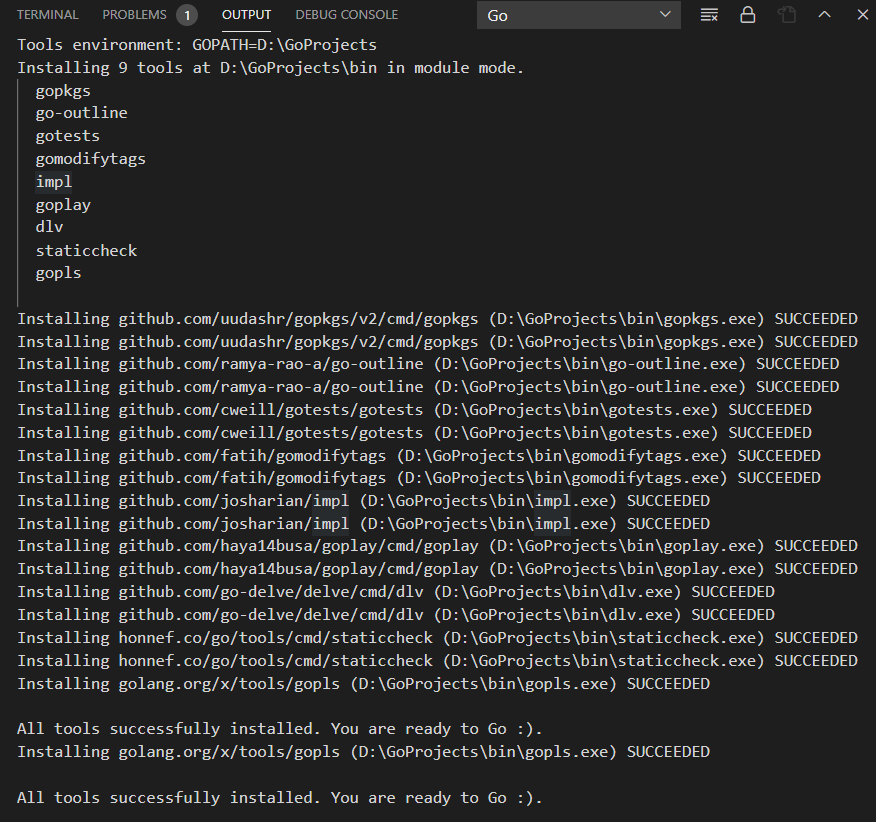
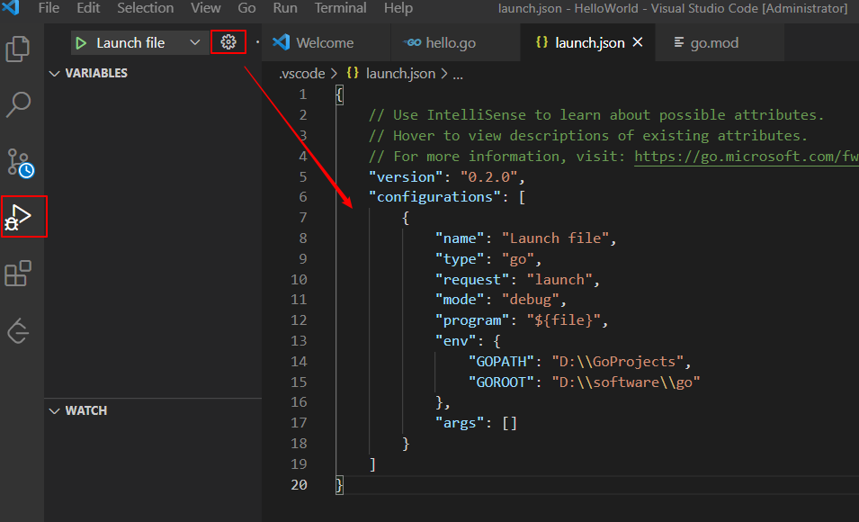

# Go语言开发环境安装
Go语言（Golang） 由Google 的 Robert Griesemer，Rob Pike 和 Ken Thompson 推出，Go语言具有并发性，可以快速编译机器码，自动垃圾回收，是一种静态强类型、编译型语言。由于Go语言的并发特性，非常适用于Web 服务器、分布式集群计算、云计算、游戏服务端等的开发。在区块链（如以太坊，Ethereum）、容器（如Kubernetes）领域都有广泛的应用。本文介绍Go语言开发环境安装方法。


<!--more-->

## 安装
Go支持支持windows、linux、mac操作系统，下面介绍Windows系统安装方法：
下载地址：[https://golang.google.cn/doc/install](https://golang.google.cn/doc/install)

go国内镜像下载地址：[https://gomirrors.org/](https://gomirrors.org/)

双击msi文件安装，安装成功后会自动加入环境变量，测试是否安装成功：`go version`
windows打开cmd
```sh
C:\Users\10287>go version
go version go1.15.6 windows/amd64
```
帮助命令：
```sh
$ go help
```

Linux系统安装：

下载安装包，使用root用户执行：

```sh
$ rm -rf /usr/local/go && tar -C /usr/local -xzf go1.16.6.linux-amd64.tar.gz
```

将`/usr/local/go/bin`添加到环境变量：`vim /etc/profile`

```sh
PATH=$PATH:/usr/local/go/bin
GOPATH=/var/GoProjects
```

```sh
source /etc/profile
go env -w GOPROXY=https://goproxy.cn
```


## Go代码编写运行

### 项目目录结构
配置一个变量名为`GOPATH`的系统变量 ，值为Go 项目的工作目录，可以是多个路径。

在工作目录`D:\GoProjects`下创建 bin、pkg、src三个目录
* bin：存放编译后可执行的文件。
* pkg：存放编译后的应用包。
* src：存放应用源代码。

还有一个环境变量叫GOROOT，是Go的安装路径，这个可以不用配置，默认添加到了环境变量

在src目录下新建一个HelloWorld的项目，新建hello.go，项目目录树如下：
```text
D:\GOPROJECTS
│
├─bin
├─pkg
└─src
    └─HelloWorld
            hello.go
```

编写代码如下：
```go
package main
import "fmt"

func main() {
    fmt.Println("Hello, World!")
}
```

HelloWorld目录下运行：
```sh
$ go run hello.go
Hello, World!
```

### go modules依赖管理
Go mod是Go语言依赖库管理器，官方推荐使用这种方法来管理依赖，相比GOPATH方法更加灵活，记录和解析对其他模块的依赖性。

Go mod是go1.11之后新增的功能，版本至少需要1.11。

打开Go mod，在windows cmd窗口输入如下命令设置环境变量：
```sh
$ setx GO111MODULE on 
```
GO111MODULE=on 表示开启模块支持，忽略 GOPATH  文件夹，根据 go.mod 下载依赖。由于国内网络问题可能无法下载go依赖包，需配置一下国内代理（七牛云提供）：
```sh
$ setx GOPROXY https://goproxy.cn,direct 
```
或者直接手动添加环境变量

下面使用go mod来管理一个项目：

**初始化项目**

项目src目录下创建的项目目录，执行如下命令：

```sh
$ go mod init
```
目录下会生成一个go.mod文件：
```text
module HelloWorld

go 1.16
```
还有一个比较常用的命令是`go mod tidy`，用于安装需要的依赖包，删除多余的包。

### 运行方式
Go是一种编译型语言，代码编写完成后，需要先进行编译后再执行。

**1、go run**

编译+执行，不生成其它任何文件

```sh
$ go run hello.go
Hello, World!
```
**2、go build**

先编译，再手动执行

- `-a`：强制编译，目标代码包和依赖的代码包（包括标准库中的代码包）都会被编译
- `-x`：会打印执行日志
- `-n`：只查看具体操作而不执行它们
- `-v`：可以看到go build命令编译的代码包的名称

```sh
$ go build hello.go
$ hello.exe
```
执行`go build hello.go`后，在windows系统上会自动生成一个后缀为exe的可执行文件，可使用`-o`参数指定编译文件名：
```sh
$ go build -o hello hello.go
$ hello
Hello, World!
```
**3、go install**

先编译，将编译好的可执行文件移动到 $GOPATH/bin目录下，将包文件放到pkg目录下。

```sh
$ go install hello.go
```

**4、go clean**

清除执行 go 命令而遗留下来的临时目录和文件

* `-i`参数：清除通过go install命令生成的文件，也就是会把bin和pkg目录下的相关文件清除
* `-cache`参数：清除go build命令生成的文件
* `-n`参数：打印要执行的清除命令，不执行清除
* `-x`参数：打印要执行的清除命令，执行清除

```sh
$ go clean -i hello.go
$ go clean -n hello.go
cd D:\GoProjects\src\HelloWorld
rm -f HelloWorld HelloWorld.exe hello hello.exe HelloWorld.test HelloWorld.test.exe hello.test hello.test.exe hello hello.exe
```
### Go 源码安装：go get
go get会自动从代码仓库（比如 GitHub.com、golang.org等）下载目标代码包，安装的路径为设置的环境变量GOPATH中。下面介绍几个常用参数：
- `-u`：下载并安装代码包，不论工作区中是否已存在它们。
- `-d`：只下载代码包，不安装代码包。
- `-fix`：在下载代码包后先运行一个用于根据当前 Go 语言版本修正代码的工具，然后再安装代码包。
- `-t`：同时下载测试所需的代码包。
- `-insecure`：允许通过非安全的网络协议下载和安装代码包。比如HTTP。

更多go get命令使用方法可参考：[https://github.com/hyper0x/go_command_tutorial/blob/master/0.3.md](https://github.com/hyper0x/go_command_tutorial/blob/master/0.3.md)

其它go命令详细文档可参考Go 语言官方文档：[https://golang.google.cn/cmd/go/](https://golang.google.cn/cmd/go/)

## 开发环境
### VSCode
VSCode比较轻量级，是我比较常用的代码开发工具。

**1、配置代理**

按照前面的方法配置

**2、安装go插件**

以管理员身份启动VSCode，然后安装go插件

**3、安装环境依赖**

VSCode打开前面创建的HelloWorld项目，打开hello.go，右下角会提示安装环境依赖，点击安装就行

**4、配置调试功能**

配置launch.json文件：

```json
{
    "version": "0.2.0",
    "configurations": [
        {
            "name": "Launch file",
            "type": "go",
            "request": "launch",
            "mode": "debug",
            "program": "${file}",
            "env": {
                "GOPATH": "D:\\GoProjects",
                "GOROOT": "D:\\software\\go"
            },
            "args": []
        }
    ]
}
```
配置完成后在go代码文件内，按F5即可进入调试状态。

### GoLand
也可以使用 JetBrains 公司推出的GoLand开发，功能更全面，下载地址：https://www.jetbrains.com/go/

## 学习资源
golang国内站点：[https://golang.google.cn/](https://golang.google.cn/)
文档：[https://golang.google.cn/doc/](https://golang.google.cn/doc/)
Go语言规范文档：[https://golang.google.cn/ref/spec](https://golang.google.cn/ref/spec)
go语言中文网：[https://studygolang.com/](https://studygolang.com/)


